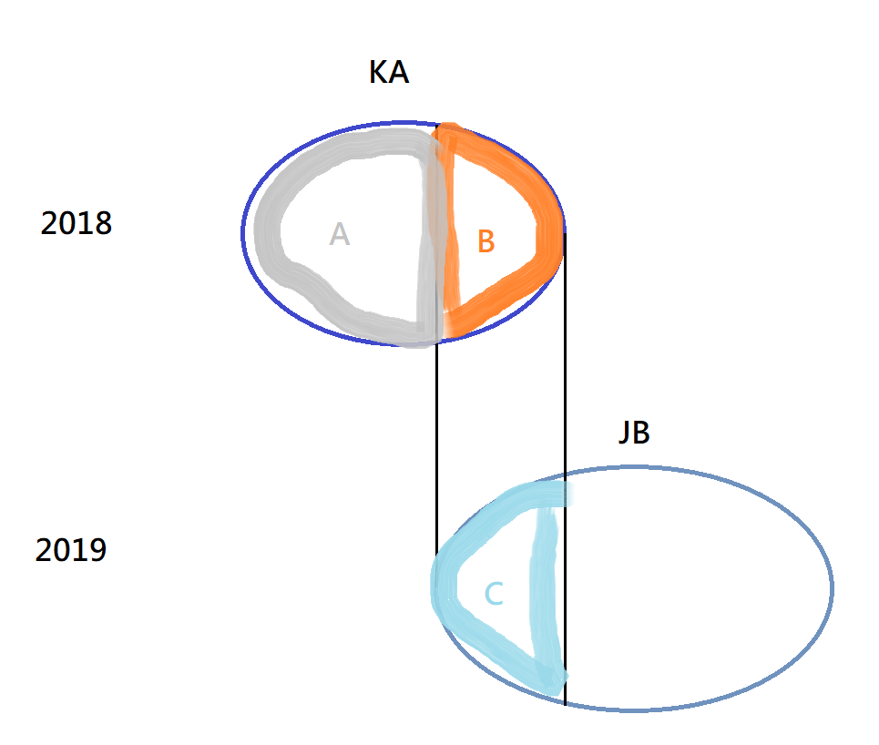

>Q4:
>如何用一些 *特徵* 描述一群客戶，並與另一群客戶做比較?
>
>特徵類別分為:
一般、活躍、頻率、貢獻、黏著、風險
>
>比較基準:
>特徵的值在母體(不做任何篩選)的百分位數，用以得知此群體在母體中的高低位置
>
>群體鎖定討論:
>1. by年 | 不分年? → by年才看得到轉換
>2. 從現在推以後(B v.s A) | 從以後推現在(B v.s C)?
>
>

## 一般
**基本資訊**

年齡、性別、婚姻狀況、居住地分佈

**通路詳細資訊** by 人

第一層 & 第二層的人次百分比
保經代: 90% ```大誠 10%, 中國 15%...```
網路: 10%

**險別資訊** by 人

買過(不論買幾張)險別_i的客戶百分比

**標的物** by 保單 (一個人有多個標的物 *(e.g.車)* 的話算多次)

Car: icar_type
Fir: use_prop
Oth: 無

**標的物** by 保單

Car: 車齡 | 品牌(?)
Fir: 屋齡(??)


## 活躍
**最近購買 (RFM的R)** Avg by: person.

**險別** Avg by: person. year.

每人年度購買險別數 | 多險別客戶占比

## 頻率
**購買週期:** Avg by person.

兩次保單間隔

## 貢獻
**平均單價**  Avg by: person. year. ipolicy.

平均每人的年度客單價
(同個ipolicy-iassured的保費總和，若有多個險種則加總)

**平均總額** Avg by: person. year.

平均每人的年度保費總額
(同**平均單價**)

## 黏著
**連續使用同一通路次數** Avg by: person. year.

1. 新客 = 1

2. 續保

  2-1: 沒有更換通路 = 連續使用此通路的保單次數 | 年度

  2-2: 更換通路 = 連續使用上次通路的保單次數 | 年度

3. 回頭客

  3-1: 同2-1

  3-2: 同2-2


## 風險

**損率** Avg by: person. year

賠償總和 / 保費總和

**賠償人次百分比** Avg by: person. year

有出險過的人次 / 總人次
